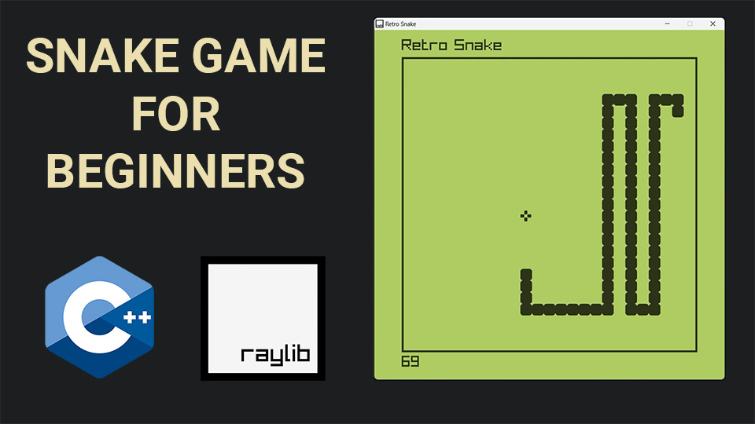

# C++ Snake game using raylib

This GitHub repository contains the full source code for a Snake game created using the raylib game development library. The game is programmed in the C++ programming language and uses various raylib functions for graphics, input handling, and audio. The game is designed to be played on desktop computers running Windows, macOS, or Linux operating systems. The code is well-structured, easy to read, and heavily commented, making it an excellent resource for aspiring game developers who want to learn more about game programming using raylib
# Video Tutorial

  

🎥 <a href="https://youtu.be/LGqsnM_WEK4">Video Tutorial on YouTube</a>

 
 

| 📺 <a href="https://www.youtube.com/channel/UC3ivOTE5EgpmF2DHLBmWIWg">My YouTube Channel</a>
| 🌠<a href="http://www.educ8s.tv">My Website</a> |  

